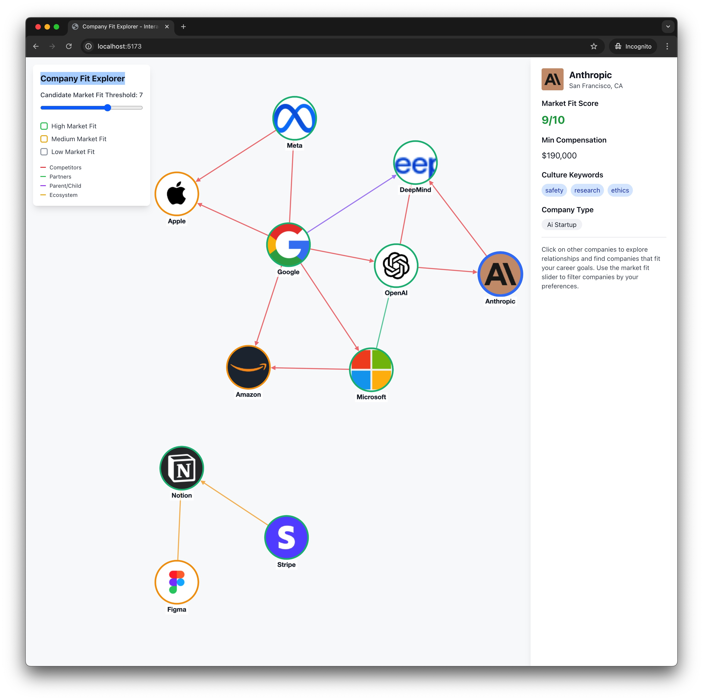

# Company Fit Explorer - Interactive CMF Graph Visualization

[](./TESTING.md)
[](./TESTING.md#coverage-reports)
[](./TESTING.md#test-driven-development-workflow)
[](./.github/workflows/ci.yml)

An interactive CMF (Candidate Market Fit) visualization tool that helps you discover companies that align with your career goals and preferences. Companies are positioned around your CMF profile based on match scores, with visual indicators for connection strength and match quality.



## ✨ Features

- **CMF-Centered Graph**: Your Candidate Market Fit profile sits at the center with companies positioned around it based on match scores
- **Precise Company Positioning**: Companies arranged in perfect circles around your CMF using exact angle/distance calculations
- **Match Quality Zones**: Visual background zones indicate excellent (90%+), good (80%+), and fair matches
- **Interactive Company Details**: Click any company to see comprehensive information:
  - Match score percentage and detailed match reasons
  - Industry, stage, location, and team size
  - Open roles and remote work policies
  - Connection types to other companies in your network
- **Connection Highlighting**: Hover over companies to see their relationships:
  - 🔵 **AI Competitors** - Companies in similar AI/ML spaces
  - 🟢 **Similar Culture** - Companies with similar values and culture
  - 🟡 **Platform Focus** - Companies with platform/API strategies
  - 🟣 **Research Focus** - Research-oriented organizations
- **Smart Visual Design**: 
  - Company nodes sized and colored by match quality
  - 2-letter abbreviations inside company circles
  - Company names and match percentages displayed below nodes
  - Smooth hover effects and connection highlighting

## 🚀 Quick Start

### Prerequisites

- Node.js (v16 or higher)
- npm or yarn

### Installation

1. Clone the repository:
```bash
git clone https://github.com/yourusername/company-fit-explorer.git
cd company-fit-explorer
```

2. Install dependencies:
```bash
npm install
```

3. Start the development server:
```bash
npm run dev
```

4. Open your browser and navigate to `http://localhost:5173`

## 🧪 Test-Driven Development

This project uses comprehensive TDD with **71 tests** covering all core functionality, ensuring reliability and preventing regressions.

### Quick Test Commands
```bash
npm test              # Watch mode for development
npm run test:run      # CI mode (run once)  
npm run test:coverage # Generate coverage report
npm run test:ui       # Visual test runner interface
```

### TDD Workflow
1. **Write failing test** → 2. **Implement feature** → 3. **Verify test passes** → 4. **Refactor safely**

**Test Coverage:**
- ✅ **71 tests** across 5 test suites
- ✅ **Utility functions** (30 tests) - Data transformations, formatting, validations
- ✅ **Component logic** (16 tests) - UI interactions, rendering, accessibility  
- ✅ **Integration testing** (15 tests) - End-to-end workflows with real data
- ✅ **Type safety** (10 tests) - Interface validation, data integrity

📖 **Complete testing guide:** [TESTING.md](./TESTING.md)

## 🛠️ Available Scripts

### Development
- `npm run dev` - Start development server
- `npm run build` - Build for production
- `npm run preview` - Preview production build
- `npm start` - Alias for `npm run dev`

### Testing
- `npm test` - Run tests in watch mode
- `npm run test:run` - Run all tests once
- `npm run test:coverage` - Generate coverage report
- `npm run test:ui` - Open visual test interface

## 🏗️ Built With

- **React 18** - Frontend framework
- **TypeScript** - Type safety
- **Vite** - Build tool and dev server
- **Tailwind CSS** - Styling
- **Cytoscape.js** - Graph visualization library

## 📁 Project Structure

```
src/
├── components/           # React components
│   ├── CMFGraphExplorer.tsx         # Main CMF graph explorer component
│   ├── CompanyGraph.tsx             # Cytoscape graph visualization
│   ├── CompanyDetailPanel.tsx       # Company details sidebar
│   └── index.ts                     # Component exports
├── data/                # Static data and configuration
│   └── companies.ts                 # CMF profile and company dataset
├── types/               # TypeScript type definitions
│   └── index.ts                     # CMF, Company, and graph type definitions
├── utils/               # Utility functions and configurations
│   ├── graphDataTransform.ts        # Graph positioning and styling logic
│   └── index.ts                     # Helper functions
├── App.tsx              # Root application component
└── main.tsx             # Application entry point
```

## 📊 Data Structure

The application uses structured data for CMF profiles and companies:

```typescript
interface UserCMF {
  id: string;
  name: string;
  mustHaves: string[];        // Critical requirements
  wantToHave: string[];       // Nice-to-have preferences  
  experience: string[];       // Relevant experience areas
  targetRole: string;         // Desired position level
  targetCompanies: string;    // Company stage preference
}

interface Company {
  id: number;
  name: string;
  logo: string;               // Company logo URL
  matchScore: number;         // CMF match percentage (0-100)
  industry: string;           // Company industry
  stage: string;              // Funding/company stage
  location: string;           // Primary location
  employees: string;          // Team size range
  remote: string;             // Remote work policy
  openRoles: number;          // Available positions
  connections: number[];      // Connected company IDs
  connectionTypes: Record<number, string>; // Relationship types
  matchReasons: string[];     // Why this company matches your CMF
  color: string;              // Node color based on match quality
  angle?: number;             // Position angle around CMF center
  distance?: number;          // Distance from center based on match score
}
```

## 🎨 Customization

### Updating Your CMF Profile

Edit the `sampleUserCMF` object in `src/data/companies.ts`:

```typescript
const sampleUserCMF: UserCMF = {
  id: "your-id",
  name: "Your Name", 
  mustHaves: [
    "Your critical requirements",
    "Non-negotiable needs"
  ],
  wantToHave: [
    "Nice-to-have preferences",
    "Additional interests"
  ],
  experience: ["Your experience areas"],
  targetRole: "Your desired role level",
  targetCompanies: "Your company stage preference"
};
```

### Adding New Companies

Add companies to the `sampleCompanies` array in `src/data/companies.ts`:

```typescript
{
  id: 16,
  name: "New Company",
  logo: "https://logo.clearbit.com/company.com",
  matchScore: 85,
  industry: "Industry",
  stage: "Company Stage", 
  location: "Location",
  employees: "Team Size",
  remote: "Remote Policy",
  openRoles: 5,
  connections: [1, 3], // IDs of connected companies
  connectionTypes: { 1: "Competitor", 3: "Partner" },
  matchReasons: ["Reason why it matches your CMF"],
  color: "#F59E0B", // Color based on match score
  angle: 45,        // Position angle around center
  distance: 100     // Distance from center
}
```

### Customizing Match Score Calculation

Match scores can be enhanced to be dynamic based on:
- Alignment with your must-have requirements
- Geographic location preferences  
- Company culture and values fit
- Role level and compensation expectations
- Industry and technical focus areas

### Styling Customization

The application uses Tailwind CSS. Key styling areas:
- `src/index.css` - Global styles
- Component classes in the TSX file for layout and colors

## 🔄 Company Connections

- **AI Competitor**: Companies in similar AI/ML technology spaces
- **Similar Culture**: Organizations with comparable values and work culture
- **Platform Focus**: Companies with platform, API, or infrastructure strategies  
- **Research Focus**: Research-oriented organizations and labs
- **Developer Tools**: Companies building tools and platforms for developers
- **Fintech APIs**: Financial technology and payment processing companies

## 📱 Responsive Design

The application is responsive and works on:
- Desktop computers
- Tablets
- Mobile devices (with optimized touch interactions)

## 🤝 Contributing

We use **Test-Driven Development** to ensure code quality. Please follow these guidelines:

### Before Making Changes
1. **Run existing tests**: `npm test`
2. **Ensure all 71 tests pass**
3. **Check coverage doesn't decrease**: `npm run test:coverage`

### Adding New Features (TDD Approach)
1. **Write test first** describing the expected behavior
2. **Run test** to confirm it fails (red phase)
3. **Implement feature** to make test pass (green phase)
4. **Refactor code** while keeping tests green
5. **Ensure coverage stays above 85%**

### Pull Request Process
1. Fork the repository
2. Create a feature branch: `git checkout -b feature/amazing-feature`
3. **Write tests for new functionality**
4. Implement features following TDD workflow
5. **Verify all tests pass**: `npm run test:run`
6. Commit your changes: `git commit -m 'Add amazing feature'`
7. Push to the branch: `git push origin feature/amazing-feature`
8. Open a Pull Request

### Test Categories to Consider
- **Unit Tests**: Individual functions and utilities
- **Component Tests**: UI interactions and rendering  
- **Integration Tests**: End-to-end user workflows
- **Data Validation**: Real dataset integrity checks

## 📝 License

This project is licensed under the MIT License - see the [LICENSE](LICENSE) file for details.

**Author:** Pierre-Andre Galmes

## 🙏 Acknowledgments

- [Cytoscape.js](https://cytoscape.org/) for the excellent graph visualization library
- [Clearbit](https://clearbit.com/) for company logos
- [Tailwind CSS](https://tailwindcss.com/) for the utility-first CSS framework

## 📞 Support

If you have questions or need help:
1. Check the [Issues](https://github.com/yourusername/company-fit-explorer/issues) page
2. Create a new issue if your question isn't already addressed
3. Provide as much detail as possible for faster resolution

---

**Happy company exploring! 🎯**